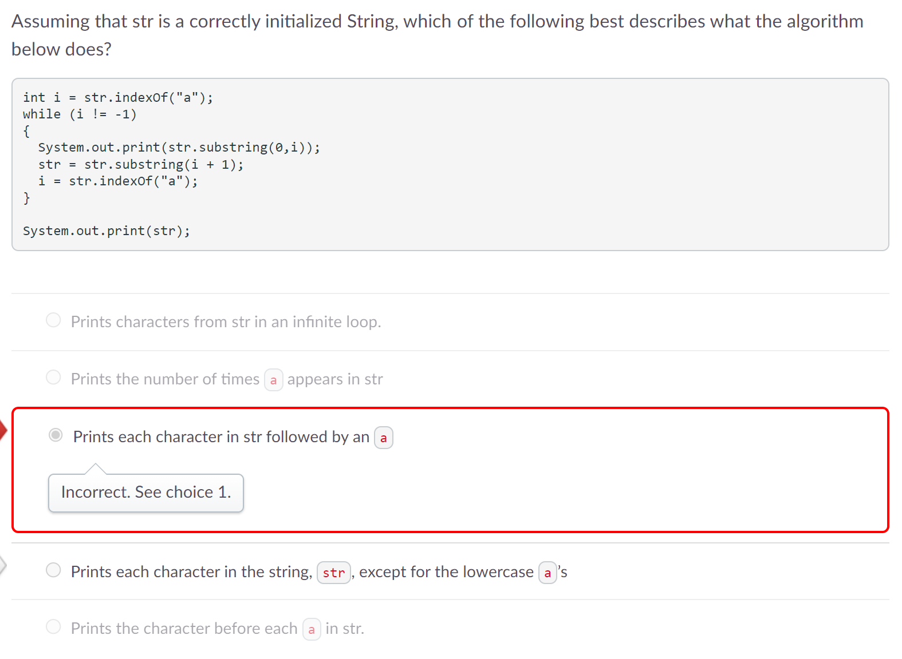
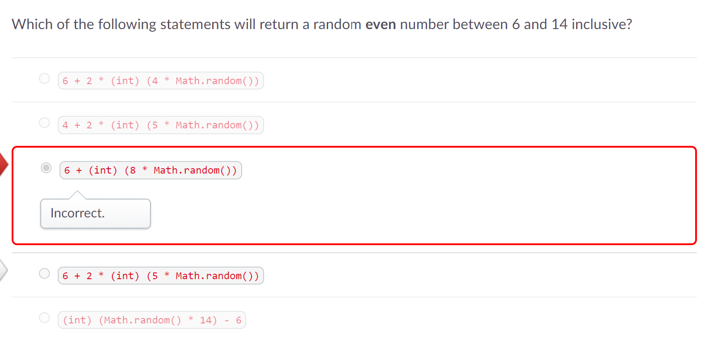
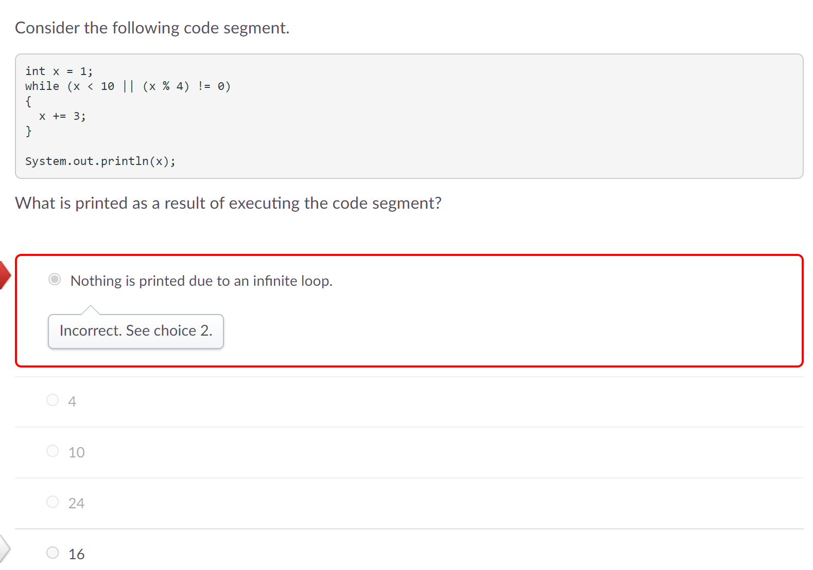
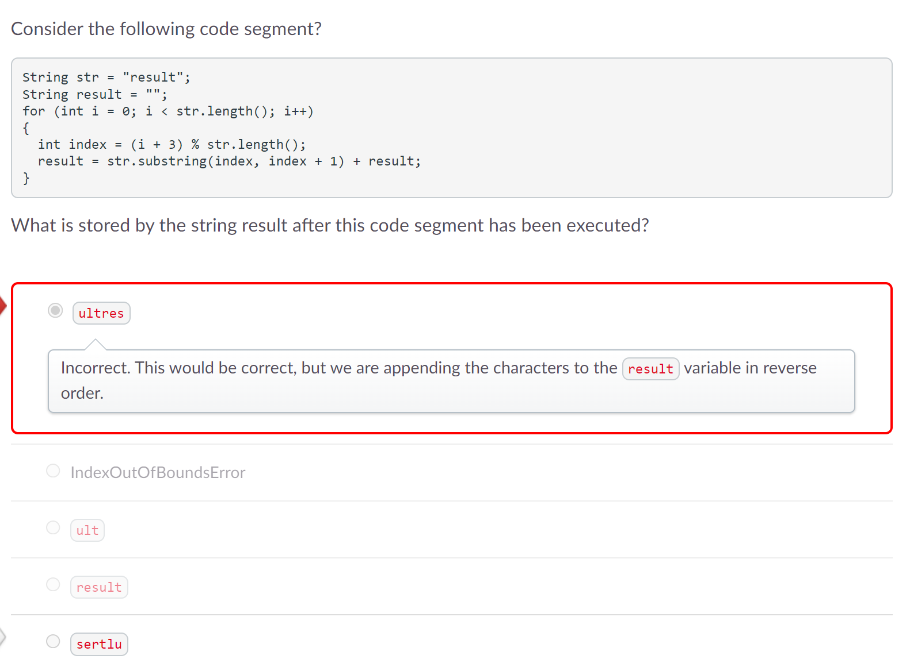
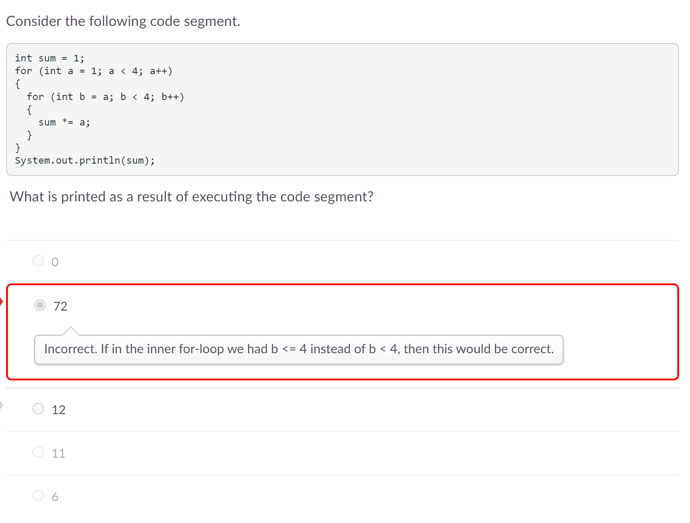

# Process Writeup
## Name: Xin Yan Huang
## Course: APCSA
## Period: 7
## Concept: Loops (UNIT 4)

### Context
I have finished Unit 3 of APCSA which was conditionals. I am now learning loops in Unit 4. Loops are a code of block that perform the same exact instructions until a condition prevents the loop from continuing to run. Loops are helpful because we don't have to write the same block of code repeatedly. There are three types of loops that I will be talking about today: `for loop`, `while loop`, and a nested loop.
### Overview
#### `while` Loop
`While` loops execute the block of code inside until the condition is not met.

Format of a `while` loop:
```java
while (/*condition inside*/){
    // code inside
}
```
Example of a `while` loop:
```java
int x = 0
while (x < 5){
    x++
}
```
The `while` loop has two components: the condition and the code that will be performed if executed. `While` loops are helpful when you don't know how many times you want the code to run.

#### `for` loop
`For` loops has four components: the initialization, condition, incrementation, and the code that will be performed if executed. Initialization is when the starting value of the loop variable gets set up and also runs on the first loop. The condition part is when the condition is evaluated to be either true or false. If false, the loop stops. If true, the code inside the for loop will be executed. Lastly, incrementation is next. Incrementation is when the loop variable is incremented by a certain number. However, this last part doesn't need to increment. The loop variable can be subtracted, multiplied, or divided by a number.

Format of a `for` loop:
```java
for (/*initialization; condition; incrementation*/){
    // code here
}
```
The initialization and condition part have to be followed by a semicolon (;) or there would be an error because the computer won't know what is going on.

Example of a `for` loop:
```java
for (int i = 0; i <= 10; i++){
  System.out.print(i + " ");
}
```
`For` loops are helpful when you do know the exact amount of times you want the code to run.

#### Nested Loops
Nested loops is a `for` loop inside a `for` loop.

Format of a nested `for` loop:
```java
for (/*initialization; condition; incrementation*/){
    // code here
    for (/*initialization; condition; incrementation*/){
        // code here
    }
}
```
The inner loop that is inside the outer loop should be indented for better readability. We start at the outer loop. If the outer loop is true the code for the outer loop if any, will be executed as well as the inner `for` loop. When the inner loop is done executing, incrementation at the outer loop occurs which restarts the outer loop getting executed.

### Challenges
I took the Unit 4 exam to check my ability to understand loops. I got a lot of questions wrong so, we are going over them to help me understand why the correct answer is the correct answer.

#### Question 2
<p align="center">
    
</p>

I wash confused with this question as I didn't have much time to spend on this question. I thought this algorithm `prints each character in str followed by an a` because I thought `System.out.print(str.substring(0,i));` prints every character and then an `a` would be printed in the end. However, this is not the case.

I will use the example, `str = "banana"` to help me explain the reason why the correct answer was `prints each character in the string, str, except for the lowercase a's`. We start off with `int i = str.indexOf("a");`. Integer `i` has the value of 1 because `a` is first appeared in the first index. Then, we get into the while loop which is true since 1 is not -1. `System.out.print(str.substring(0,i));` will print out `b` because it is the index we want and the index we don't want. For `str = str.substring(i + 1);`, `String str` will now be `"nana"` because the substring tells us to start at (i + 1) all the way to the end and the index after `a` is the second index which contains the letter `n`. Now, integer `i` still has the value of 1 because `a` is first spotted at the first index. The process continues until `String str` is empty. The output would be: `bnn`. This leaves out all the lowercase `a`.

#### Question 4
<p align="center">
    
</p>

The question is asking us which statement would print out either `6`, `8`, `10`, `12`, or `14`. I chose `6 + (int) (8 * Math.random())` which was incorrect. `(int) (8 * Math.random())` would mean the number generator would print out either , `0`, `1`, `2`, `3`, `4`, `5`, `6`, or `7`. When you add either number to 6, there would still be odd numbers which is not what we are looking for.

`6 + 2 * (int) (5 * Math.random())` is the correct answer. `(int) (5 * Math.random())` would give us `0`, `1`, `2, `3`, or `4`. When we multiply one of these numbers by 2 there would only be even numbers. When we multiply these numbers by 2, we get `0`, `2`, `4`, `6`, and `8`. If we add these numbers to 6, we would get `6`, `8`, `10`, `12`, and `14` which fits the question's criteria.

`6 + 2 * (int) (4 * Math.random())` and `4 + 2 * (int) (5 * Math.random())` are similar to the correct answer but, are missing a number. `(int) (Math.random() * 14) - 6` would not make sense because if `Math.random()` generates a zero, the number would be negative which there are no negative numbers in the question's range.

#### Question 16
<p align="center">
    
</p>

I didn't have enough time to work on question 16. I quickly chose one of the options.

Since this is a `while` loop, the loop can run either once or multiple times. First, we look at the condition `x < 10 || (x % 4) != 0`. We can perform short circuit evaluation, skipping the second evulation if the first evaluation is true. Short circuit evaluation can only be use when there is an OR (`||`) operator. Starting at the value of 1, the condition is true updating `x` to have the value of 4. Now that `x` is equal to 4, the condition, `x < 10` is still true making `x` equal to 7. The condition still evaluates to true because 7 is less than 10 making `x` equal to 10. Now, the first condition evaluates to false because 10 is not less than 10. We have to look at the other condition, `(x % 4) != 0` to evaulate the whole condition as true. `(7 % 4)` equates to 3 which is not 0 so, this whole condition is true turning `x` into a 13. A tip I got from Mr. Mueller about the not equal operator (!=) is that instead of saying the `!=` operator as `not equal to`, remember this as `different from`. Now that `x` is 13, the condition, `x < 10` won't be true meaning we have to look into the second condition from now on to evaluate the entire condition. `(13 % 4)` equates to 1 which is different from 0. This would make `x` as 16. For the next condition, `(16 % 4)` equates to 0 which is not different from 0 stopping this `while` loop. The final value of `x` is 16.

#### Question 19
<p align="center">
    
</p>

For this question, I did the calculations correct but I didn't pay enough attention to understand what `result = str.substring(index, index + 1) + result;` meant.

We see that `String str` is the original string and `String result` is the new string that will be formed. First, we look at the initialization. Integer `i` is being set equal to 0. Second, we have to evaluate the condition which is true because 0 is less than 6 (`str.length()`). Third, we look at the code that is inside the `for` loop. Integer `index` is being declared and set equal to this expression: `(i + 3) % str.length();`. Fourth, we have to calculate this expression to find out which letter will be added to `String result`. We start off with `(i + 3)`. Right now, `i` is equal to 0. 0 plus 3 equals 3. Now, we do `3 % str.length()`. 3 modulo 6 is 3 because there is 3 remaining. Fifth, we look into the next line. `String result` gets added by `str.substring(index,index + 1)` and `result`. Since `result` is added before `str.substring(index,index + 1)`, the previous letter will be pushed towards the back. We start at the third index because of 3 (i + 3) modulo 6. The next indices would be 4 and 5 which the letters are `l` and `t`. The output right now is `tlu`. When `i` is incremented to 3, the integer `index` will now be 0 because `(3 + 3) % str.length()` is 0. We know the next letters would be `e` and `s` because the `for` loop can only run 6 times according to the condition. The most current letter would be `s`. Now, `s` would be first since previous letters go towards the end of the string. The final output would be: `sertlu`.

A great tip that I got from my classmate is to execute the last condition before the condition evaluates to false. This would have save so much time.

The last condition that is true is when `5 is less than 6 (str.length())`. When we do calculations, `index` will be 2 because `(5 + 3)` equates to 8 and `8 % str.length()` equates to 2. The letter of the second index is `s`. Letter `s` would be the first letter of the string because the newer letters are closer to the front. There is only one option with letter `s` at the front. This is a brillant technique to tackle these types of problems.

#### Question 20
<p align="center">
    
</p>

For this question, I read `sum *= a` as `sum *= b`. We are not multiplying `sum` by `b` everytime `b` increments.

We start off with `a` equal to 1. In the inner loop, `sum` will be multiplied by `a` three times. Integer `sum` will still be 1 since one times one equals to 1. Now, the inner loop doesn't get executed and `a` increments to 2. This time, the inner loop will only run two times. The `sum` will now be 4. In the first time, `sum` gets multiplied by 2 making `sum` equal to 2. In the second time, `sum` gets multiplied by 2 again making `sum` equal to 4. The inner loop doesn't run and `a` increments to 3. The inner loop will run 1 time since b is already at 3 and the loop doesn't run if `b` is greater than or equal to 4. Finally, `sum` will be multiplied by 3 making the `sum` equal to 12. Here is a more visual respresentation of what I am talking about:
``` java
a   b   sum
// when a = 1
1   1   1
    2   1
    3   1

// when a = 2
2   2   2
    3   4

// when a = 3
3   3   12
```

### Takeaways
* If applicable, start with the last possible condition that is true
* Truly understand what the line of code does before you try to find the answer
* Think `!=` as different from instead of `not equal to`
