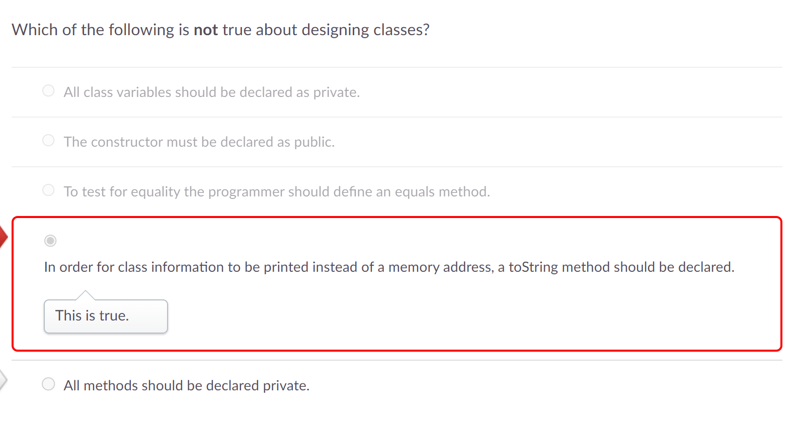
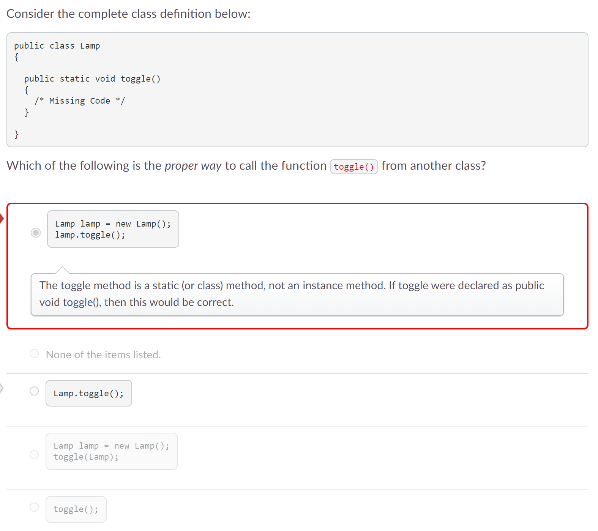
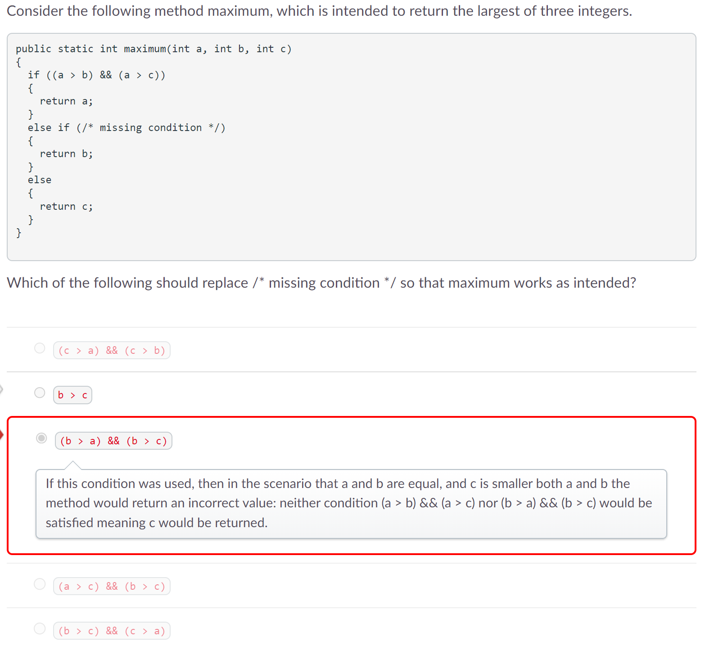
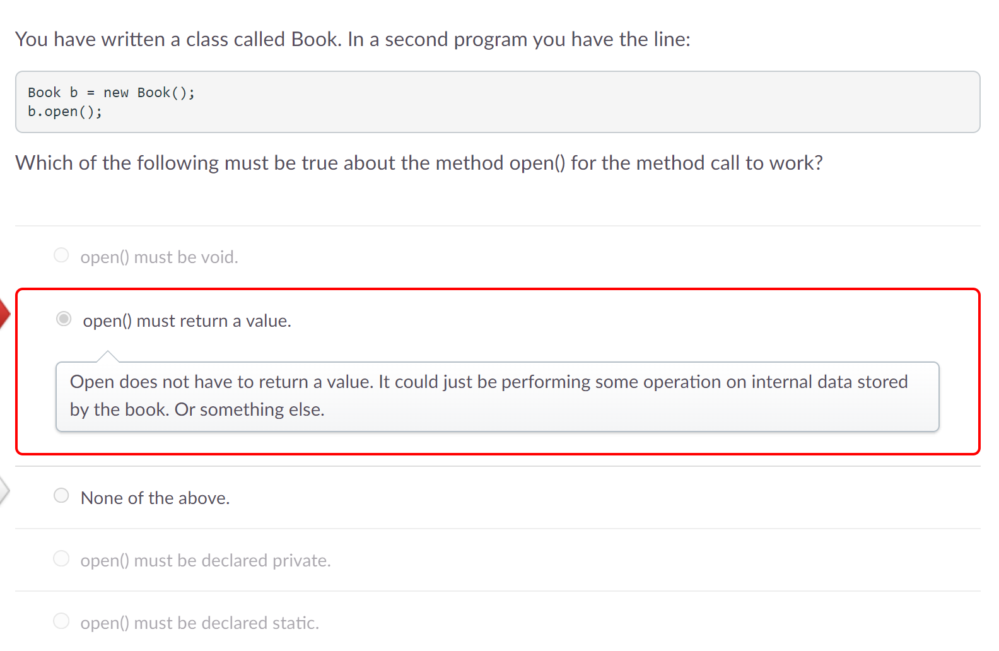

# Process Writeup
## Name: Xin Yan Huang
## Course: APCSA
## Period: 7
## Concept: Classes (UNIT 5)

### Concept
As I am typing right now, I have completed Unit 4 of APCSA which was loops. Unit 5 of APCSA is classes. A class is a "blueprint" for creating objects, an instance or copy of the class.

### Overview
#### Void Methods
Void methods do not return any value but, these methods can print outputs. Here's the format of a void method:
```java
public static void printOne(){
    System.out.println("1");
}
```

#### Parameters
Parameters are local variables inside a method or constructor header. They contain data that is going to be sent into the method or constructor. Parameters have different data types such as `int`, `double`, `String`, etc. To include multiple parameters inside the header, use a comma after each parameters but not the last parameter.

Format of a single parameter:
```java
public static void square(double x)
{
  System.out.println(x * x);
}
```
`double x` would be the parameter.

Format of multiple parameters:
```java
public static void pow(int x, int y)
{
  System.out.println(Math.pow(x, y));
}
```
`int x` and `int y` are the parameters.

#### Arguments
Arguments are the data that is sent to a method. Arguments occur when a method is being called if the method has parameters. Here's an example of what I am talking about:
```java
public static void squareIt(double x)
{
  System.out.println(x * x);
}

public static void main(String[] args){
    double val = scan.nextDouble();
    square(val);
}
```
`val` inside the parenthesis of the sqaure method is the argument. When the argument gets passed in, the data now becomes a parameter to help the `squareIt` method.

#### Primitive Parameters
If a void method mutates the value of a primitive, the changes are not permanent because primtives are stored inside their own memory.

#### Class Parameters
On the other hand, class data types do get changed when a void method makes changes to the class.

#### Return Methods
Return methods return a value back to the calling method.

#### Constructors
Constructors are methods that create an instance or copy of a class. What is different between constructors and methods is that constructors are named after the class name. Here's an example:
```java
public class Car(){
    private String carName;
    private String model;
    private int year;
    public Car(String cn, String md, int yr){ // constructor
        carName = cn;
        model = md;
        year = yr;
    }
    public getCarName(){ // method
        return carName;
    }
}
```
Constructors can either have no parameters, one parameter, or multiple parameters.

#### Javadoc
Javadoc are another type of comments different than the single-line and multi-line comments. Javadoc comments start with `/**` and end with `*/`. For each line that is a javadoc comment, you need an asterisk, `*` before writing any comments.

Format:
```java
/**
 *  This method calculates the difference between a circle and a rectangle area.
 *  @param circ a Circle object
 *  @param rect a Rectangle object
 *  @return a double representing the difference in area between the two shapes.
 */
```

### Challenges
On the Unit 5 test, I got four questions wrong. I am going over these questions to help me learn and understand my mistakes.

#### Question 2
<p align="center">
    
</p>

For the first question I got wrong, I clearly did not look at the question carefully. The question is asking to the find the answer choice that is **not true**. I chose the answer choice that is true. I immediately looked at this answer choice thinking this was the correct answer. The answer choice, `All methods should be declared private.` is the correct answer because if we look back at the examples of methods, they are not `private` but, `public`. Private methods are used when you do not want the method to be accessed by another class. The word, `All` also gives the answer away because

#### Question 4
<p align="center">
    
</p>

For this question, I was hesitant between my answer choice and `Lamp.toggle();`. Both of these answer choices would work for their uses. I did not know which option would be for calling from another class during the time of the test. The reason why `Lamp.toggle();` is correct is because the `toggle()` method is static meaning this method only belongs to the Lamp class. If another class calls this method, there would be an error as only the Lamp class can access this method. In order for another class to access the `toggle()` method, the other class needs to call the Lamp class to call the `toggle()` method. It should look like this: `classofthemethod.toggle()` which in this case is `Lamp.toggle()`.

#### Question 8
<p align="center">
    
</p>

In my opinion, this question has two technically right answers. One of the answers which I picked was marked as wrong. The objective of this question is to find the condition that will return `b` as the maximum value. The first option that I see, `(c > a) && (c > b)`, is incorrect because this condition checks if `c` is the maximum value not `b`. Option, `(a > c) && (b > c)`, does not really make sense because it is checking if `c` is the minimum value. We are not looking for minimum values. Option, `(b > c) && (c > a)`, is checking if value, `c`, is the middle value, not the maximum and not the minimum value. Option, `b > c` was the test's right answer because if `a` is not the maximum, we only have to check if `b` or `c` is the maximum. For the `else if` statement, we want to return `b` as the maximum value so, `b` would have to be greater than `c`. I am not sure why my answer, `(b > a) && (b > c)` is the wrong answer when it is technically correct. One reason I can think of is that my answer choice is not the most efficient. Next time, I should consider which answer choice would be more efficient if two answer look like they are the answers.

#### Question 18
<p align="center">
    
</p>

For question 18, I was comtemplating because all answers might be true. I chose `open() must return a value.` because I thought returning a value meant returning a boolean so if a Book object is open, then the boolean should be true. After going over this problem, I realized that most of the options have the word, `must`. This word makes every option say that we need `open()` to exactly be this which is false. The word, `must` is kind of saying like `needs`. `open()` does not need to be void, return a value, be declared private, or be declared static.

### Takeaways
* Do not rush answering a question
* Find the option that is most efficient
*