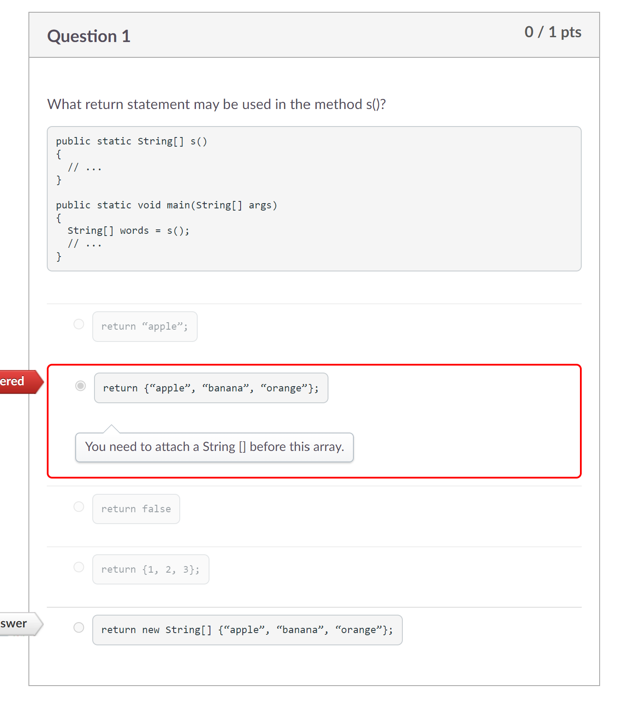
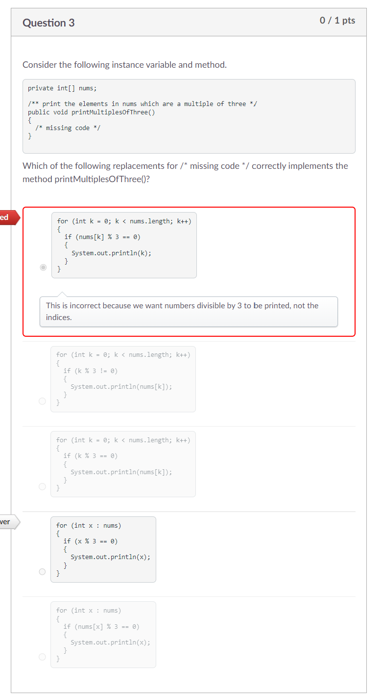
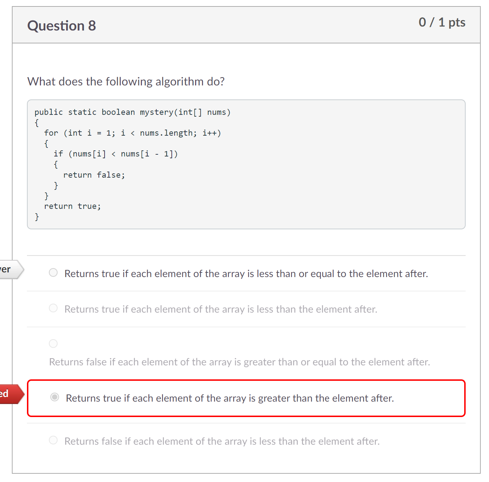
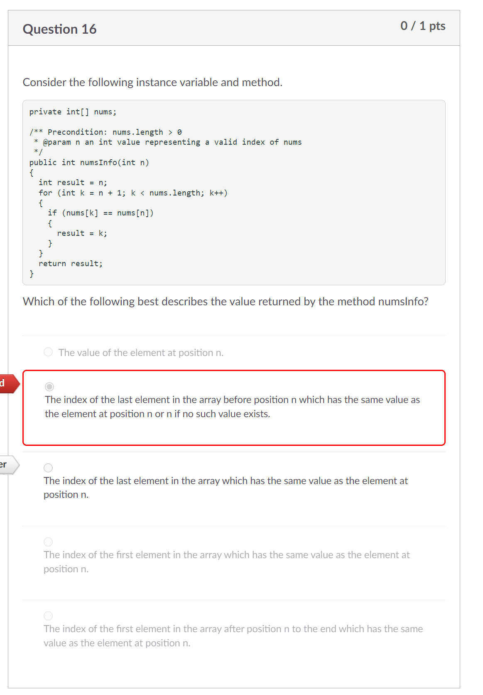

Process Writeup
## Name: Xin Yan Huang
## Course: APCSA
## Period: 7
## Concept: Arrays (UNIT 6)

### Context
Unit 5 of the APCSA cirrculumn has been completed. I am now on Unit 6 which is all about arrays. The purpose of an array is to store multiple values in a variable. Your usual `int`, `double`, `String`, and `boolean` variables can only carry one value at a time. When you insert square brackets at the end of the variable type, you can now hold multiple values at once. This is how you initializing an array would look like: `int[] num`.

### Overview
#### `.length`
When you want to find the specific length of the array, you put a `.length` after the array name.

For example:
```java
int[] numbers = {2, 3, 4, 5, 6}; // we are initializing an integer array to hold these values

System.out.println(numbers.length); // the output would be 5 since there are 5 values in total in the array
```

#### Accessing a Specific Index
An index of the array is the position of the value. Indices (index in plural) range from 0 to the maximum amount of indices you can store in a single array.

If you want to find out a specific index's value, you would type: `variableName[#]`. The `#` means the index of the array. For example, to print out the 6th index of the array, it would look like this:
```java
int[] numbers = {1, 2, 3, 4, 5, 6};
System.out.println(numbers[5]); // the output would be 6
```

The reason I typed `5` instead of 6 is due to the reason that indices start from `0` not `1`. The first index would be `numbers[0]` which has the value of 1.

#### Changing Values
When you want to change the value of an index in the array, you need to assign the index a new value. Here's what I am talking about:
```java
int[] numbers = {1, 2, 3, 4, 5, 6};
numbers[4] = 4; // the array should look like this: 1 2 3 4 4 6
```
I assigned the fourth element or index to the value of 4. The fourth index originally had the value of 5 but, it has been replaced by the value of 4.

#### Insertion


#### Deletion


#### Shifting Elements (Right or Left)


#### Printing Using an Enhanced For Loop


### Challenges
For the Unit 6 exam, I gotten 4 questions wrong. I am going over these questions to clarify why my answers were wrong.

<p align="center">

</p>

For the first question, I wasn't completely sure what the question was asking. I do know that the method `s()` returns an array of String. The only options I am left is `return {"apple", "banana", "orange"};` and `return new String[] {"apple", "banana", "orange"};`. I chose the first option because I thought `words` already had an array with values. However, my assumption turned into a mistake. `String[] words` didn't actually have an array with values mentioned. You would need to return a new String array because


<p align="center">

</p>

For question 3, the question is asking us to find the code that will print the index that is divisible by 3. My answer choice prints the index number which I clearly didn't see. I didn't check if the code will actually print the value of the index. For my answer choice to be correct, the code will need to be this: `System.out.println(nums[k]);` instead of `System.out.println(k);`. The letter, `k`, represents the index in the array.

<p align="center">

</p>

For question 8, this is the question that I should have not gotten wrong. I first originally chose the incorrect answer, `Returns true if each element of the array is greater than the element after`. Then, I went to work on the other questions as I had more difficulty solving those questions. Next, I came back to this question to spend more time because I knew my answer choice was wrong. We first look at the condition, `nums[i] < nums[i - 1]`. The current element has to be less than the previous element in order for this condition to be true. The answer choice should contain `greater than the element after.` If we look at the options, there is only two options. The option that I chose was incorrect. I didn't change the answer

<p align="center">

</p>


### Takeaways
* Always look at the entire answer choice before deciding which answer choice to choose from
*


