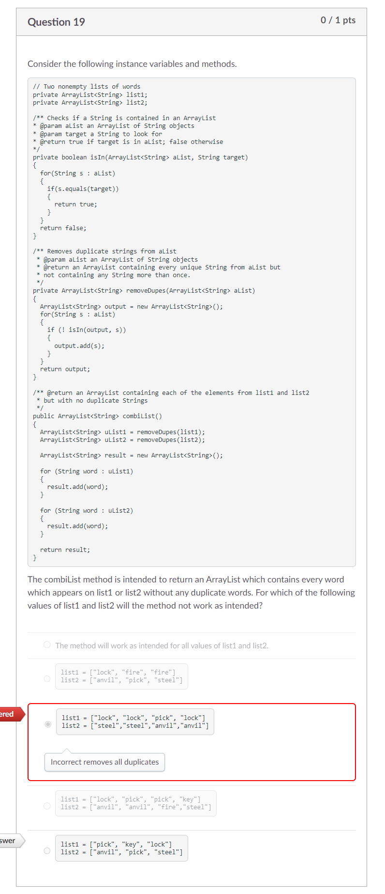
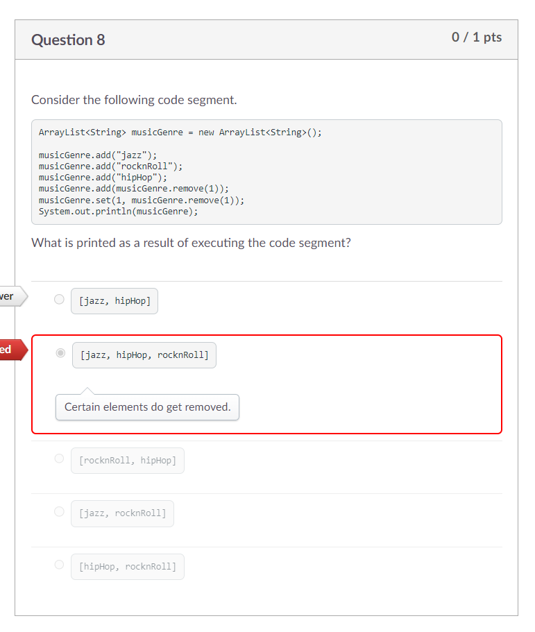

Process Writeup
## Name: Xin Yan Huang
## Course: APCSA
## Period: 7
## Concept: ArrayLists (UNIT 6)

### Context
I was previously working on arrays which is Unit 6 of the APCSA cirriculumn. Now, I am on Unit 7 which is ArrayLists. ArrayList is similar to the array but, there is a major difference. In arrays, you can not change the size of the array. Once you initialize the maximum amount of elements you want to put in an array, you can not add more elements. On the other hand, an `ArrayList` can be resized to any amount you want. You can add an element in the `ArrayList` by using the `add()` method. To initialize an `ArrayList`, you start off typing `ArrayList`. Then, you would type the data type you want the `ArrayList` to hold. This needs to be wrapped in angled brackets, `<>`. It should look this this as of right now: `ArrayList<Integer>`. After this, you create a name for the `ArrayList` and set it to a new `ArrayList` of the data type you want. Here's what it would look like: `ArrayList<Integer> nums = new ArrayList<Integer>();`.

### Challenges

**This is a long image**
<p align="center">

</p>

For question 19 of the exam, I didn't have enough time to answer this question. I was just clicking a random answer choice. Now that I have more time to think about it, I see why my answer choice was incorrect.

The `combiList()` method calls out the `removeDupes()` method which also calls out the `isIn()` method to check if there are any duplicates. The `removeDupes()` method adds only elements that don't have a duplicate. The `removeDupes()` and `isIn()` method will only check and remove for one method. You can't remove and check different ArrayLists at the same time. When you combine these ArrayLists that have been checked for duplicates, you run the possibility of having duplicates. This is because one Arraylist might have the same element as another ArrayList. If you run the methods again to check if the combined ArrayList has any duplicates, there shouldn't be a duplicate after that. If you look at the answer choices, most of the options have a duplicate on an ArrayList which makes the combiList method to look like there isn't a bug. However this option contradicts the combiList method:
```java
list1 = ["pick", "key", "lock"]
list2 = ["anvil", "pick", "steel"]
```
Since `pick` is on both ArrayLists and only the `isIn()` method and `removeDupes()` method only check at specifically one ArrayList. When you combine these lists together, you would get this: `pick, key, lock, anvil, pick, steel`. There is a duplicate which is `pick`.


<p align="center">

</p>

For this question, I should have spent a little more time since I had a better chance getting this correct. The line, `musicGenre.set(1, musicGenre.remove(1)));` confused me. The `.remove()` method means that you are removing an element off the ArrayList. When you put `.remove()` inside the `.add()` method, you would add the removed element to the end of the ArrayList. However, I found out that when the method is inside the `.set()` method, the element will be overridden by another element.

First, the musicGenre ArrayList will have `jazz`. Second, `rocknRoll` would be added at the end of the ArrayList. Third, `hipHop` would be added. Fourth, `rocknRoll` would be removed to be added at the end of the ArrayList. `hipHop` would shift to the index of one. Right now, `rocknRoll` would be at the index of two. The next line, `musicGenre.set(1, musicGenre.remove(1));` is where an element would be overridden. The element at the first index would be removed due to `musicGenre.remove(1)` which is `hipHop`. This would shift `rocknRoll` to the position of index 1. The `.set()` method would make `hipHop` override `rocknRoll` which gives us the answer of `[jazz, hipHop]`.

### Takeaways
* Focus more on the questions you have a higher chance of getting a question right on
* Don't panic too much
* Spend some time to get a little understanding of a problem