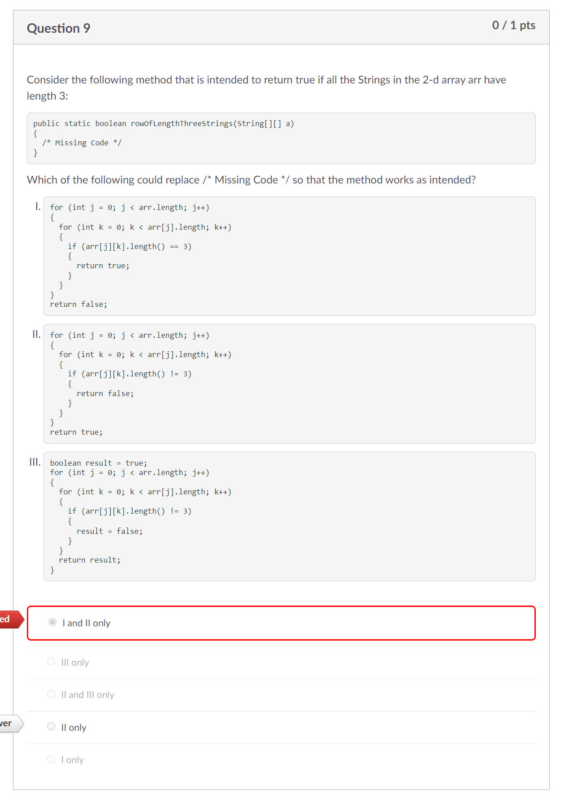
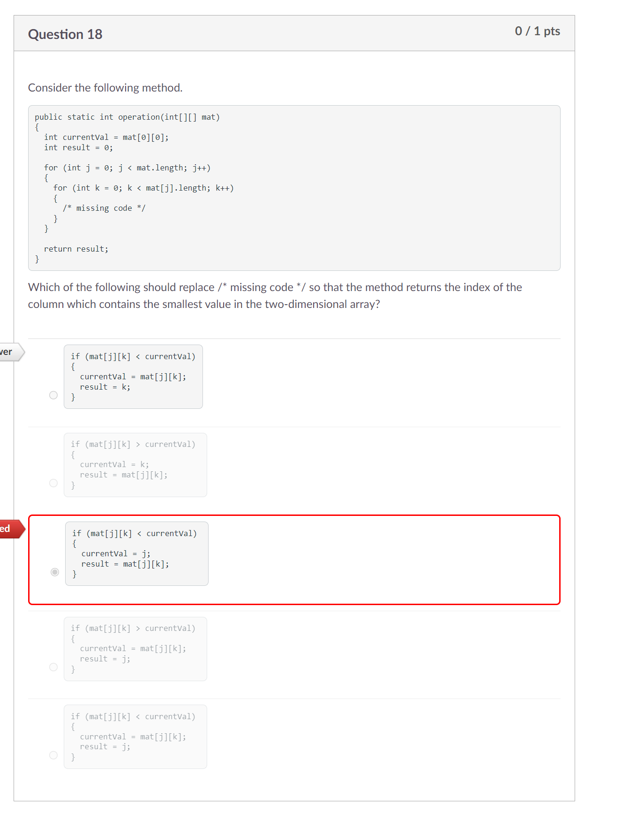
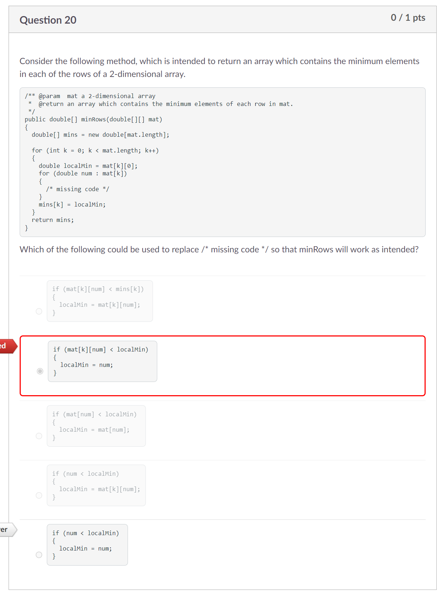

# Process Writeup

## Name: Xin Yan Huang
## Course: APCSA
## Period: 7
## Concept: Unit 8

### Context
Previously, I was working on ArrayLists which is similar to arrays. Now, I am working on Unit 8 of the APCSA cirriculmn which is 2D Array. 2d means 2 dimensional. 2d arrays are similar to a regular array. The difference is that 2d arrays are an array inside of an array. This is how you would initialize a 2d array: `int[][] nums = new int[2][3];`. While an array has one square bracket after the array type, a 2d array has two square brackets.

### Challenges

#### Question 9

    

For this question, the question is asking you to return `true` if all Strings in the 2d array have the length of 3. There can't be a single `String` that doesn't have the length of 3 or otherwise, we return false.

When taking upon a closer look at all three options, I eliminated `III` first because you have to return a value outside of the `for()` loop. In addition, the line that says, `return result;`, is inside the first `for()` loop. Hypotethically, if the first row of elements all have the length of 3, they would return as `true`. However, the code doesn't take into consideration about the rest of the elements in other rows. When you return a value inside a `for()` loop, the `for()` loop stops executing. Now that we stopped the `for()` loop, the rest of the elements in the other rows could not have the length of 3 which could make the boolean spit out false information.

I was now down to two options, `I` and `II`. I didn't understand the question well enough at the time of taking the test. I thought that both options looked like they were inverses which mean the same thing. However, there is a difference. At option `I`, the inner `for()` loop would return `true` after the condition, `arr[j][k].length() == 3`, is true. This condition is like the same as the condition in option `III`. We would return `true` without knowing if all elements actually have the length of 3.

The only correct answer was option `II`. Since we are looking to see if all elements have the length of 3, we can just write code that returns `false` if only one element doesn't have the length of 3.

#### Question 17

    

#### Question 20

    

### Takeaways
* Take time to read the question more carefully