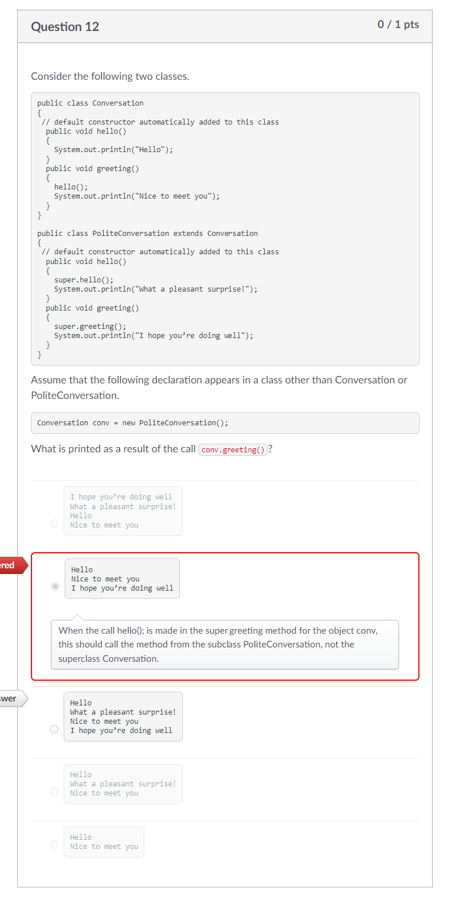
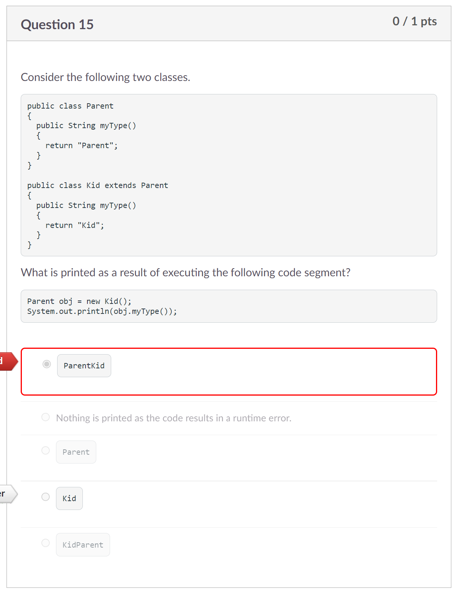
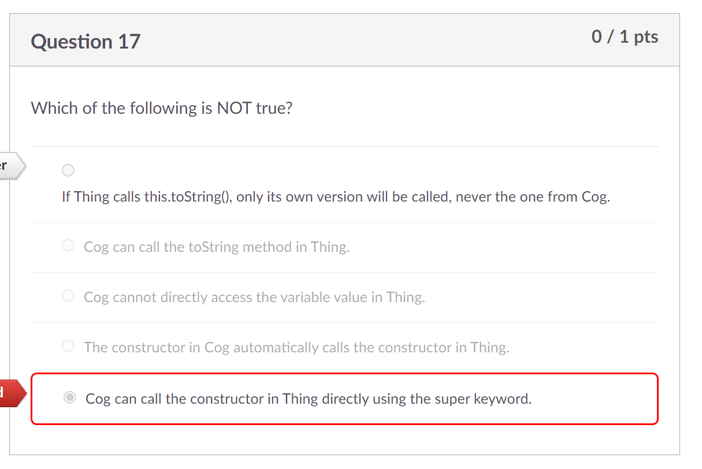
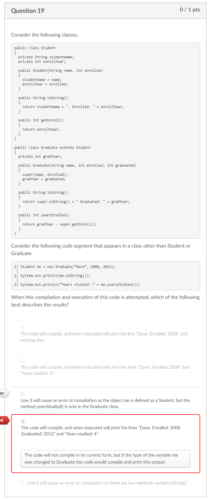

# Process Writeup

## Name: Xin Yan Huang
## Course: APCSA
## Period: 7
## Concept: Inheritance (UNIT 9)

### Context
For this unit, there is nothing to crazy to learn about. In Java, a class can inherit traits from another class. However, a class can inherit traits from only one class. A `subclass` or `child` class is the class that is inherit trais from another class. A `superclass` or `parent` class is the class that is letting another class to access their public methods/variables.

### Challenges
On the Unit 9 exam, I got 4 questions wrong which I will be going over on this writeup.

#### Question 12
<p align="center">

</p>

This question was difficult to solve since this is an example of polymorphism. I wish that I studied more about this topic. Anyways, my answer choice for this question was this:
```
Hello
Nice to meet you
I hope you're doing well
```

In my mind, I thought since a `Conversation` object was declared, the `hello` method would be called on the `Conversation` class. However, since the `Conversation` object was declared as a `PoliteConversation` object, we call the `hello` method in the `PoliteConversation` class. Here's the process to get the correct answer for this question:

1. The `greeting` method is called first in the `PoliteConversation` class.
2. The `greeting` method in the `PoliteConversation` class then calls the parent class's `greeting` method.
3. The `greeting` method in the `Conversation` class calls the `hello` method in the `PoliteConversation` class.
4. The `hello` method in the `PoliteConversation` class then calls the `hello` method in the `Conversation` class.
5. `Hello` is printed and a new line is printed afterwards
6. After calling the parent class's `hello` method, `What a pleasant surprise!` is printed next.
7. After the `hello` method is done, the `greeting` method from the `Conversation` class will print out `Nice to meet you`.
8. Since the `greeting` method in the `Conversation` class is done, we go back to the `PoliteConversation` class's `greeting` method to finally print out `I hope you're doing well`.

#### Question 15
<p align="center">

</p>

For this question, I thought that this is an implicit "super" question. The reason why I picked `ParentKid` was that the `public String myType()` method in the `Kid` class would called the parent class's `public String myType()` method. However, I realized that only constructors have the implicit "super". Since this is a `String` method, you can not use the implicit "super".

Since `obj` has `Kid` properties, `Kid` would only be returned.

#### Question 17
<p align="center">

</p>

Here is the hierarchy:
```
Thing (parent)
Cog (parent of Gear & child of Thing)
Gear (child of Gear)
```

This question was confusing. I thought the correct answer to this question was true. I thought that the `this.toString()` was refering to the `Thing` class's `toString()` method. We first can eliminate `Cog can call the toString method in Thing.` because since `Cog` is the child of `Thing` and the `toString` method is public, `Cog` can use the `super` keyword to access `Thing`'s `toString` method. We can also eliminate `Cog cannot directly access the variable value in Thing.` because the variable `value` in `Thing` is private. A child class can't access its parent's private variables/methods. We can also eliminate `The constructor in Cog automatically calls the constructor in Thing.` because the implicit "super" works in this case. Here was my mistake after going back to question:

Since `Thing` is the parent of `Cog`, the `Cog` class can access `Thing`'s public methods & variables with the `super` keyword. The `Gear` class can't directly access `Thing`'s public methods and variables with the `super` keyword. I mistakenly thought `Cog` was `Gear` which lead me to choose my answer choice.


#### Question 19
<p align="center">

</p>

We have established that `me` is a Student object. `me` can't access the `yearsStudied()` method because the method is in the `Graduate` class. A parent class can't access its child class's public methods/variables.

My answer choice was `Line 3 will cause an error at compilation as the object me is defined as a Student, but the method yearsStudied() is only in the Graduate class.` because I thought since the `Student` class is declared as `Graduate`, the `Student` class can access the `Graduate`'s methods/variables.

### Takeaways
* Reread the options so that you don't end up mistake a class name for something else
* Practice more on polymorphism
* Look carefully if the code is a constructor or a method
