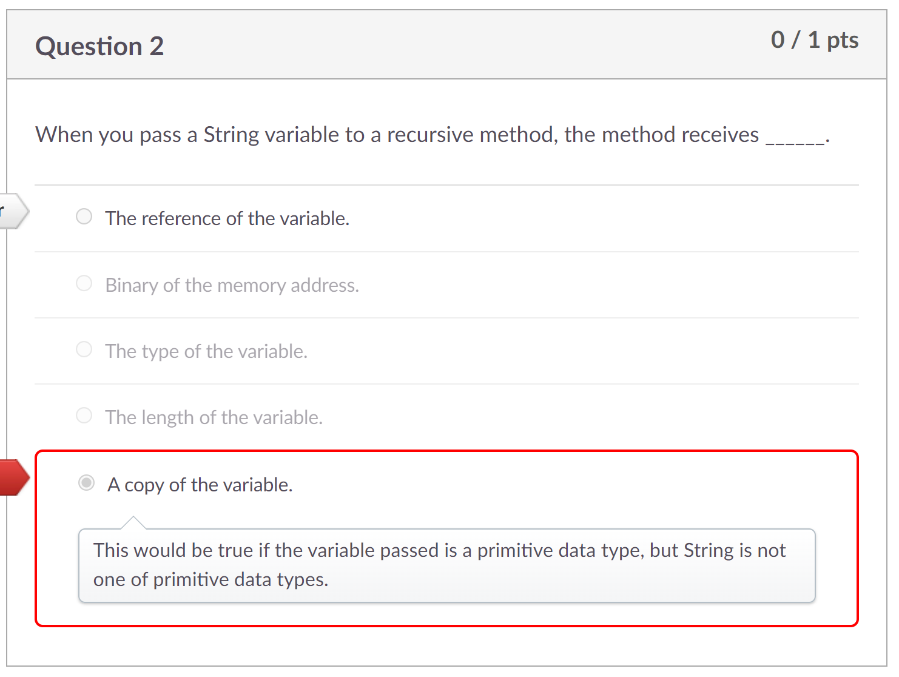
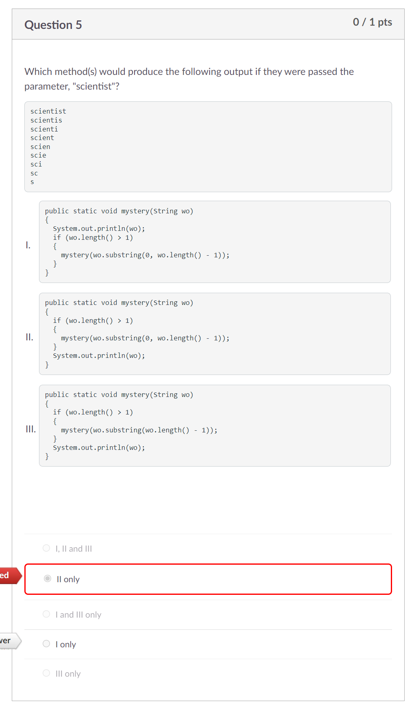
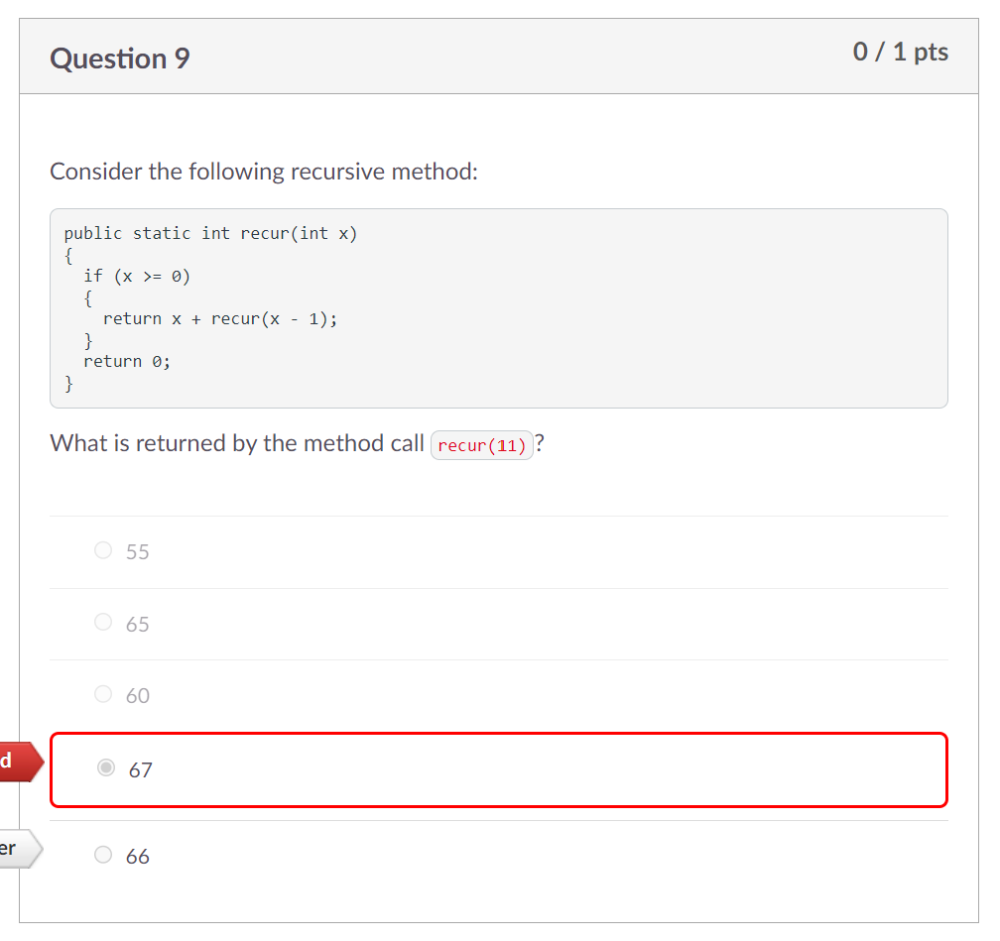
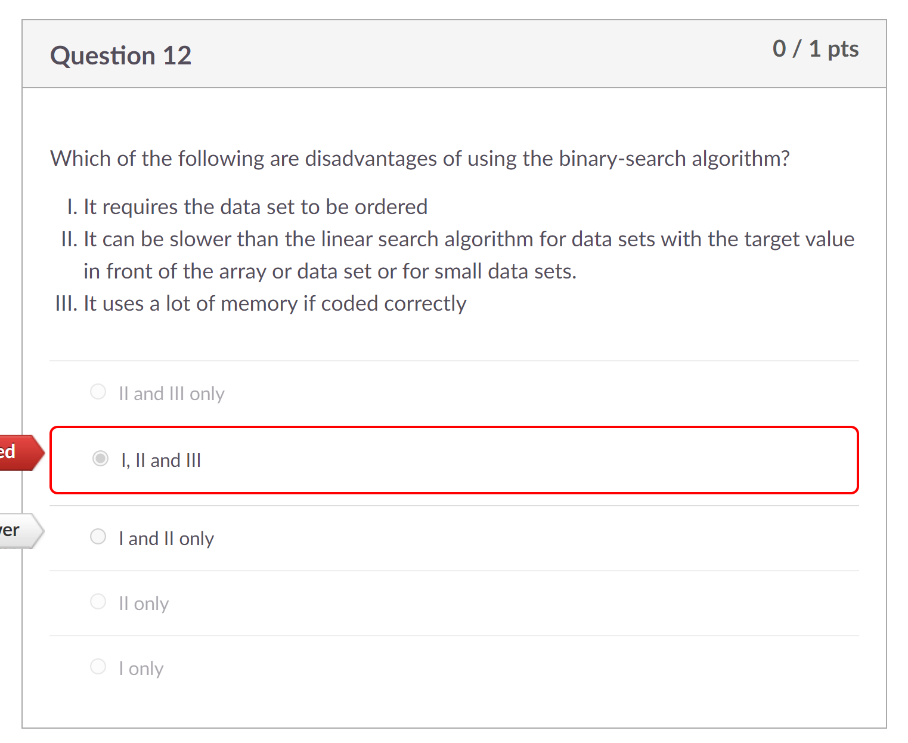
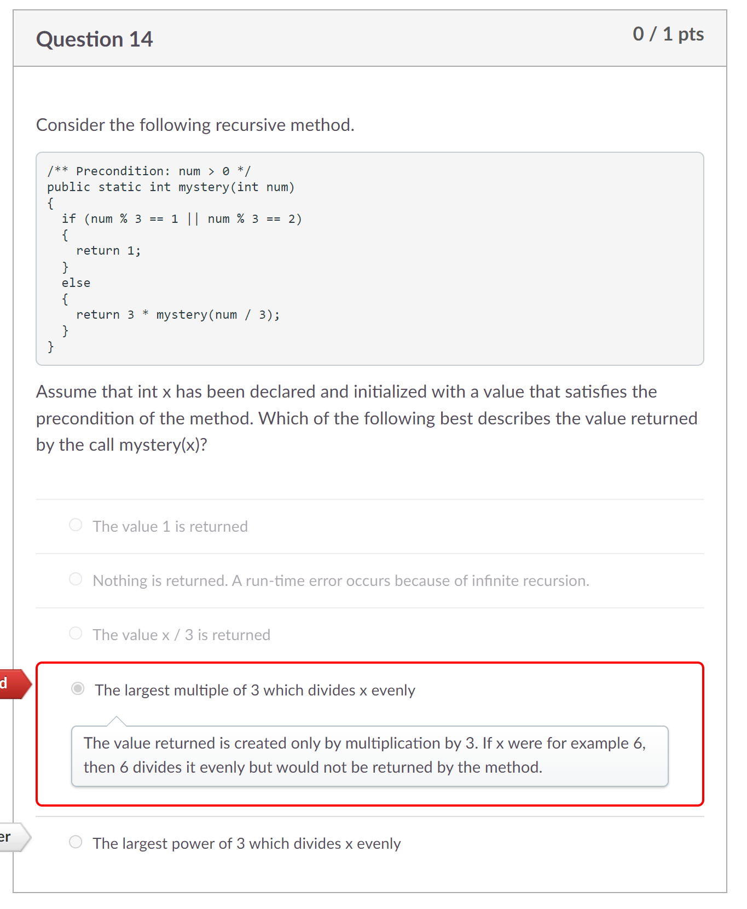

# Process Writeup

## Name: Xin Yan Huang
## Course: APCSA
## Period: 7
## Concept: Recursion (UNIT 10)

### Context
In this unit, we are learning about recursion. In short, recursion involves with a method inside a method. Recursion can be coded in loops but, it is more mainstream to see recursion in a method inside of a method.

### Challenges

<p align="center">

</p>

In a method, a `String` variable is part of the class data type. However, a `String` is immutable meaning that a `String`'s reference point can't be changed. That is why the correct answer to this question is `The reference of the variable.`

<p align="center">

</p>

For this question, I chose `I only` at first and then later changed to `II only` later which was incorrect. I should have trusted my gut feeling. The output that is displayed above the Roman numeral choices are at first, the word, `scientist` is displayed and then for every line, one letter at the end of the word isn't present until you are left with one letter.

We can already eliminate the third option already because of this line of code: `mystery(wo.substring(wo.length() - 1));`. This means that we would print out from the end of the word not the start of the word.

Now that we are left with two options, we can finally eliminate `II` because the code will be printed afterwards which would skip the first line: `scientist`.

<p align="center">

</p>

For this question, I don't remember where I did the calculations wrong. I think I miscalculated when n was 9 or 10. I will explain later. When 11 is passed through this method, we run the `if` conditional. We will keep running the `if` conditional when `x` is -1 because -1 is not greater than or equal to 0.

This is how the recursion will work:
```
x	return
11	11 + recur(10)	0+0+1+2+3+4+5+6+7+8+9+10+11 = 66
10	10 + recur(9)	0+0+1+2+3+4+5+6+7+8+9+10
9	9 + recur(8)	0+0+1+2+3+4+5+6+7+8+9
8	8 + recur(7)	0+0+1+2+3+4+5+6+7+8
7	7 + recur(6)	0+0+1+2+3+4+5+6+7
6	6 + recur(5)	0+0+1+2+3+4+5+6
5	5 + recur(4)	0+0+1+2+3+4+5
4	4 + recur(3)	0+0+1+2+3+4
3	3 + recur(2)	0+0+1+2+3
2	2 + recur(1)	0+0+1+2
1	1 + recur(0)	0+0+1
0	0 + recur(-1)	0+0
-1	return 0        0
```
The answer to this question would be 66.

<p align="center">

</p>

This question made me hesitant. I knew that `II only` and `II and III only` would be incorrect because the binary-search algorithm needs to be in order to be able to run this algorithm. I wasn't sure about if the binary-search algorithm needed a lot of memory. Now, I know in fact that binary-search algorithms don't need a lot memory.

<p align="center">

</p>

This is how recursion would work for this question:
```
n 1 --> return 1
n 2 --> return 1
n 3 --> 3 * mystery(1) --> 3 [3 % 3^1 = 0]
n 4 --> return 1
n 5 --> return 1
n 6 --> 3 * mystery(2) --> 3*1 --> 3 [6 % 3^1 = 0]
n 7 --> return 1
n 8 --> return 1
n 9 --> 3 * mystery(3) --> 3 * mystery(1) --> 3 * 3 --> 9 [9 % 3^2 = 0]
```

If we take 6 for example, the code should have returned 6 since 6 is the largest multiple of 3 that we could divide evenly. However, this is not the case which we can eliminate the answer choice, `The largest multiple of 3 which divides x evenly`. If we are still unsure, we can continue to when `n` is 9. When `n` is 9, we return 9. The exponents of 3 would be 3, 9, 27, and so on. The answer choice, `The largest power of 3 which divides x evenly` would be the correct answer.

<p align="center">

</p>

For this question, I messed up with the steps. I ended up with 4 which was not the answer. I was writing all over the paper which was difficult to see the table. I will definitely to keep in mind to stay more organized. Anyways, after creating a table, our first step is to compare `vals.get(mid).intValue() < num` which is true since 4 is less than 5. Next, we run the code inside that conditional which we set `low` to `mid + 1` which is 4. Then, we run the while loop again. This time, `high` is still greater than `low` so, we set `mid` to 5 and run the `if` condition again. Now, we run the next condition because the value of the ArrayList at index 5 is 8 which is bigger than 5, the `num`. That means `high` would be set to the value of 5. Afterwards, we run the while loop again which we have to set `mid` to 4 since (4 + 5) / 2 is 4 in integer form. Next, we run the `if` condition again which is true because the value at index 4 is 4 and is less than 5, the `num`. We set `low` to 5. When we run the while loop, it doesn't work because 5 is not greater than 5. Then, the line, `vals.add(low,new Integer(num));` gets called. Since the question is asking us for the value of low, the answer would be 5.

### Takeaways
* trust your gut feeling
* organize your work
* Use process of elimination to get a higher chance of getting the question correct
