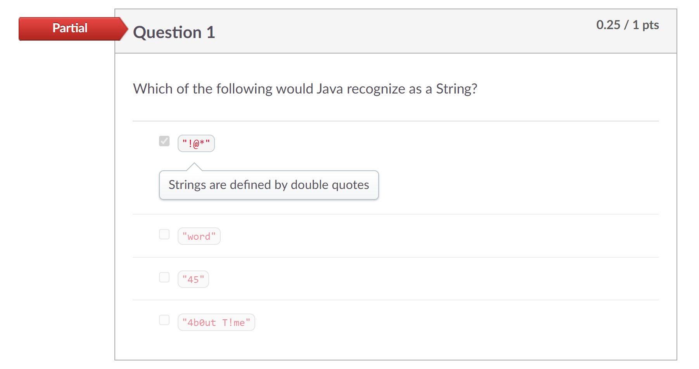
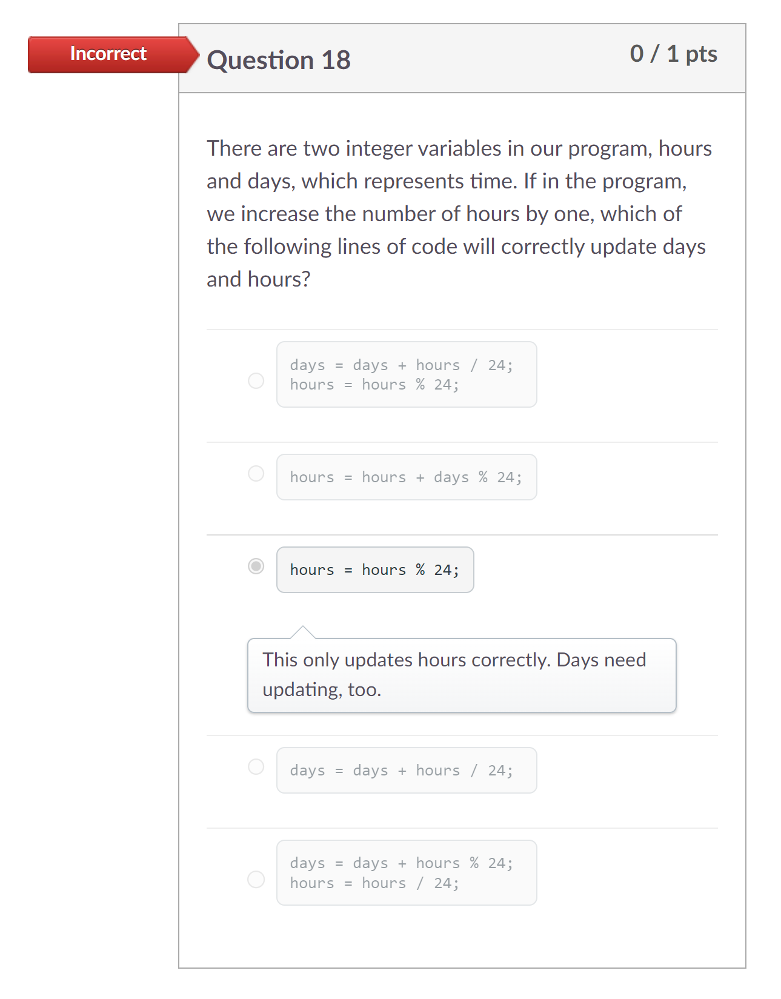
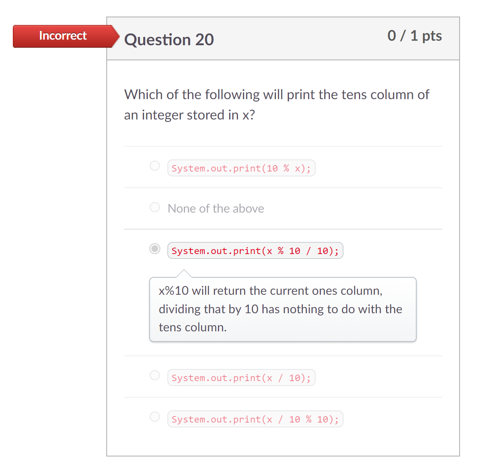

# Process Writeup
## Name: Xin Yan Huang
## Course: APCSA
## Period: 7
## Concept: Primitives (UNIT 1)

### Context
I am now in the 12th grade. I am taking APCSA (Java) for my senior year. For this unit topic, I am learning primitives (Unit 1). Primatives are a data type in Java that only hold one piece of data at a time. To help me learn more about data types, [Project Stem](https://projectstem.org/) is going to guide me through the APCSA curriculum.

### Overview


### Challenges
I have made quite a lot of mistakes throughout this unit. However, that's a good thing. Learning your mistakes are essential to improving at things. Most of the mistakes I've made were simple for the Project Stem lessons. However, one of the review questions below for one of the lessons I've did was hard for me to get it correct.

<p align="center">

</p>

All of the options were correct as a `String` is defined in double quotes. You can put letters, special characters, and numbers inside a `String` data type. I thought if I only clicked one option, I would get full credit. When I click submit, this question still came out as partial credit whenever I only click one option. Then, I realized that the options were a check box and not a circle. I was right about all the options were correct. I just needed to click all of the options to get full credit on this question.

I was stuck on Unit 1: Lesson 4 Coding Activity 1. You were suppose to let the user input a number. Then, the number should be added four times and then subtracted four times. The final answer should be the number the user inputted. Here's an example ofe what I am talking about:
```
Enter starting number (must be an integer)
>24 (input number)
number is now 25
number is now 26
number is now 27
number is now 28
number is now 27
number is now 26
number is now 25
number is now 24
```
I wrote this block of code below to finish this lesson. However, it was not the expected output I thought in my head.


```java
Scanner scan = new Scanner(System.in);
int num;
System.out.println("Enter starting number (must be an integer)");
num = scan.nextInt();
System.out.println("number is now " + num++);
System.out.println("number is now " + num++);
System.out.println("number is now " + num++);
System.out.println("number is now " + num++);
System.out.println("number is now " + num--);
System.out.println("number is now " + num--);
System.out.println("number is now " + num--);
System.out.println("number is now " + num--);
```
Result:
```
Enter starting number (must be an integer)
24
number is now 24
number is now 25
number is now 26
number is now 27
number is now 28
number is now 27
number is now 26
number is now 25
```

The first output statement was the original number when it should have been 25 since `24 + 1 = 25`. I first asked on [Slack](https://slack.com/) on the `2024-apcsa` channel for help. There wasn't a reply but, Mr. Mueller (my APCSA teacher) told me to ask on the `java` channel to get a better chance of someone helping me. Someone actually did end up helping me solve this problem. The person said that `num++` in the print statment doesn't actually increase `num` by 1 until I use the variable in the print statment. In the first print statement, `num++` doesn't work but, it is now activated which the next `num++` which work as intended. The person told me to fix this issue, you need to do `++num`. I think this works because the `++` is telling the computer to increase some variable value by 1 but it doesn't know which variable to increase. Since `num` is after the `++`, the computer will now increase the value of `num` by 1.

#### Exam Questions
For the Unit 1 exam, I have done well enough to get a high grade but, I got two questions wrong. The first question I got wrong was question 18. Here's what the question says and what I put as my answer:

<p align="center">

</p>

The question asks us to correctly update days and hours. From the option I picked, I only updated the hours correctly. I did not chose an answer that also updated the days. The correct answer would have been the first option.
```java
days = days + hours / 24;
hours = hours % 24;
```
##### Breakdown of the First Option
When you look at the first line of code, there are two variables and one variable is being divided by 24. The first line of code means that now the `days` variable is stored the value of the former `days` value plus the `hours` value divided by 24. We first look at the `hours / 24` because computers also follow the order of operations. When we increase the hours by one, `hours / 24` is going to be an integer. The next step would be adding the `days` value to the number of `hours / 24` which is going to also be an integer. This would give us the correct value of the `days` variable.

The last question I got wrong was question 20. Here's what the question says and what I put as my answer:

<p align="center">

</p>

This question was from one of the coding activities I had to complete. I didn't remember what to do for this question at the time I took the exam. The actual answer was the last option: `System.out.print(x / 10 % 10);`.

##### Breakdown of the Last Option
We are going to start off with `x / 10` since computers follow the order of operations. We can use an example to help us figure out why the last option is the correct answer. Our example `x` integer value would be `127`. The value of the tens place is `2`. When we plug in `x` as 127, `12` is the output because dividing an integer with a whole number gives you a whole number. We then calculate `12 % 10`. The mod, `%` operator gives us a remainder of the division between 12 and 10. This modulo calculation gives us an answer of `2` which is the value of the tens place.

### Takeaways
* It is okay to make mistakes (they are here to help you grow and learn)
* Use slack if you are stuck on something
* Try to get help from a larger group of people who know what topic you are learning 