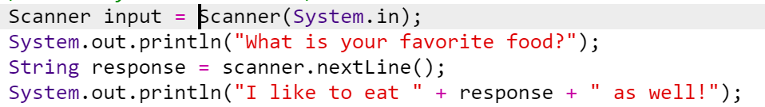

# Process Writeup
## Name: Xin Yan Huang
## Course: APCSA
## Period: 7
## Concept: Primitives (UNIT 1)

### Context
I am now in the 12th grade. I am taking APCSA (Java) for my senior year. For this unit topic, I am learning primitives.

### Challenges
I have made quite a lot of mistakes throughout this unit. However, that's a good thing. Learning your mistakes are essential to improving at things. Most of the mistakes I've made were simple.



#### Exam Questions
I have done well enough to get a high grade but, I got two questions wrong. Question 18 said:
```
There are two integer variables in our program, hours and days, which represents time. If in the program, we increase the number of hours by one, which of the following lines of code will correctly update days and hours?
```

Question 20 said:

```
Which of the following will print the tens column of an integer stored in x?
```


### Takeaways
* It is okay to make mistakes (they are here to help you grow and learn)
* Use slack if you are stuck on something