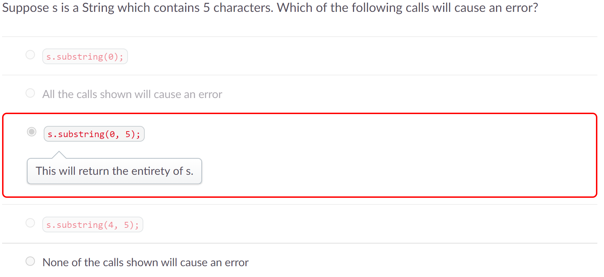
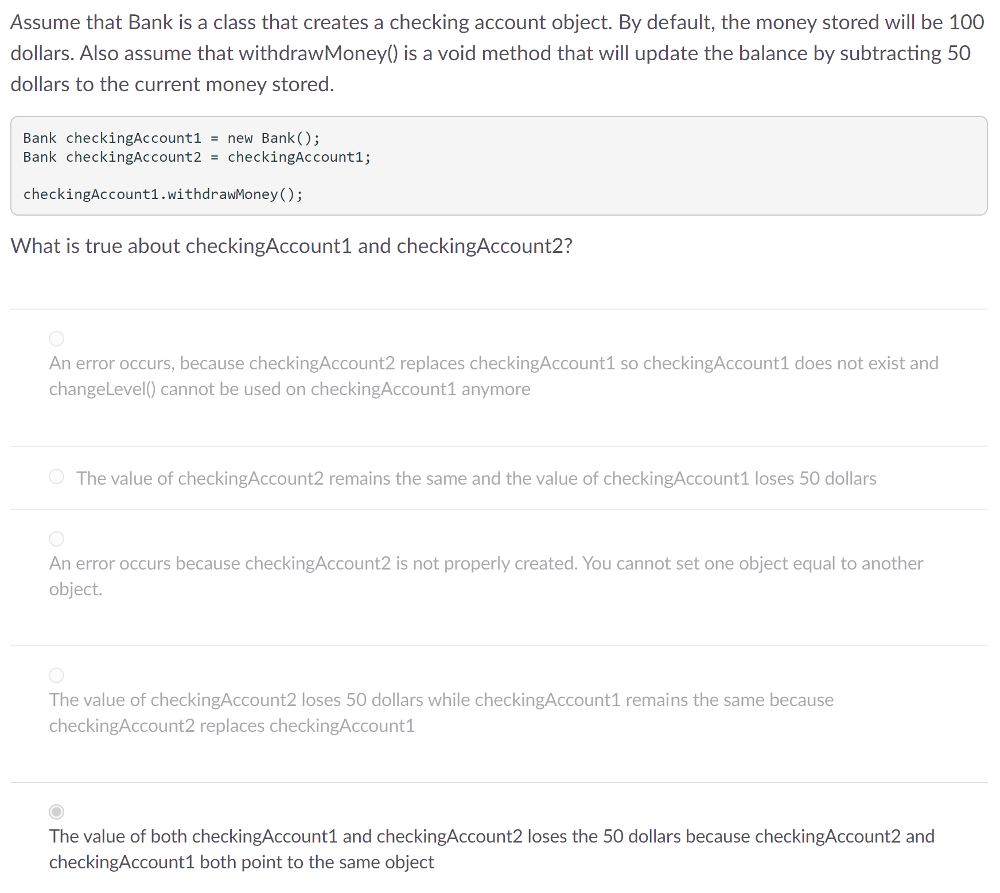

# Process Writeup
## Name: Xin Yan Huang
## Course: APCSA
## Period: 7
## Concept: Objects (UNIT 2)

### Context
I have completed Unit 1 of APCSA which was primitives. I am now learning about objects (instances or copies of a class) in Unit 2.

### Overview of the Project Stem Lessons
#### Lesson 1: Strings and Class Types
There are two types of data types in Java:
* primitive
* class (reference)
##### How each data types are different
```
Primitive:
* are lowercase
* hold one piece of data at a time

Class (Reference):
* are uppercase
* hold several pieces of data at a time
* store data as references (memory location of the data)

```

#### Lesson 2: Escape Sequences and String Concatenation
##### String Concatenation
We use the addition (`+`) operator to concatenate (add) strings together.
Example:
```java
String helloWorld = "Hello" + "World";

```
##### Escape Sequences
We use escape sequences to change the interpretation of the specific characters to prevent an error.
Here are some of the escape sequences:
* `\\` - include backslash
* `\"` - include literal double quote
* `\'` - include literal single quote
* `\n` - include new line
* `\t` - include new tab

#### Lesson 3: String Methods
Here are some important `String` methods:
* `.length()` - returns the total amount of characters in a string
* `.equals(String otherString)` - compares two strings to see if both strings match
    * returns true if both strings are the same
    * returns false if both strings are not the same
* `.indexOf(String str)` - returns the first index of the `str` in the string that is using this method
* `.substring(int firstOneYouWant, int firstOneYouDontWant)` - extracts index(es) from first parameter to the index before the second parameter
* `.substring(int firstOneYouWant)` - extracts the specific index from the parameter to the end
* `.toUpperCase()` - capitalizes all characters in the string
* `.toLowerCase()` - lowercases all characters in the string
* `.compareTo(String otherString)` - compares two strings alphabetically
    * returns 0 if both strings are the same
    * returns a `+` number if otherString is before the string that is using this method
    * returns a `-` number if otherString is after the string that is using this method

#### Lesson 4: Classes and Objects
##### Difference between a class and an object
A class is a blueprint for the object. An object is an instance (copy) of a class. Objects have states (values that are stored in memory) and behaviors (actions an object can run).
##### Declaring an Object's data type
We use the `new` keyword when declaring the object's data type.

#### Lesson 5: Using Constructors
##### Circle Constructors Meaning
* `Circle()` - creates a circle with radius of `1.0`
* `Circle(double rad)` - creates a circle with specified radius
##### Rectangle Constructors Meaning
* `Rectangle()` - creates a rectangle with length and width of `1.0`
* `Rectangle(double length)` - creates a rectangle with both length and width of specified value
* `Rectangle(double length, double width)` - creates a rectangle with length and width based on respected values
##### RegularPolygon Constructors Meaning
* `RegularPolygon()` - creates an equaliteral tringle with side length of `1.0`
* `RegularPolygon(int num)` - creates a polygon based on given value with the default side length of `1.0`
* `RegularPolygon(double len)` - creates an equaliteral triangle with side length based on given value
* `RegularPolygon(int num, double len)` - creates a polygon based on give `num` value with side length based on `len` value
#### Lesson 6: Using Methods
Methods perform specific tasks when executed.
##### Void and Non-Void Methods
* Void methods - doesn't return any value back to us
* Non-Void methods - do return a value
    * we get this value by assigning it a variable or use print statements

##### Overloaded Methods
Methods can be overloaded meaning the method can have the same name but, based on the parameters(parameters in order, parameter's data type) of the method, it can perform different tasks.

#### Lesson 7: Wrapper Classes
##### Wrapper Classes
Wrapper classes are objects for primitive data types. Since primitive data types can only hold a piece of data at a time, by "wrapping" primitive data types, we can do so much more than storing data. Each primitive data type has its own wrapper class. Wrapper classes are found in the `java.lang` package.
##### Autoboxing
Autoboxing is converting a primitive data type into its wrapper class. I like to memorize autoboxing as your small gift box (this would be the primitive data type) that only holds one item gets put inside a huge box (this could be the wrapper class) that can store more items.
##### Unboxing
Unboxing is converting a wrapper class to a primitive data type. I like to memorize unboxing as you are unboxing a huge box (this is the wrapper class) and inside the huge box you get a small gift box (this would be the primitive data type) that holds one thing.

#### Lesson 8: Math Functions
##### Math class methods
Math class methods can help us to simple arithmetics so, there's no need for manual calculations.
###### List of Math class methods
* `Math.abs()` - takes the absolute value
* `Math.pow(double base, double exponent)` - returns a value of the first double raised to the second double
* `Math.sqrt(double num)` - returns a square root of a double
* `Math.random()` - returns a random double between 0 and 1
    * use casting if you want to be an integer


### Challenges

#### Exam / Quiz Questions
For the Unit 2 quiz which consisted of lessons 1-4, I got a question wrong. It was this question:
<p align="center">

</p>

Here's why I chose this answer:

When there are two parameters it means the following: `theFirstIndexYouWant, theFirstIndexYouDontWant`. However, there are two options with the same number in the second parameter: `s.substring(0,5);` and `s.substring(4,5)`. Both options have the number 5 in the second parameter. I ignored the fact that if both options contain the same parameter, both of them might not be the correct answer. I ultimately chose `s.substring(0,5);` at the end as my answer which was incorrect. The first option, `s.substring(0);` didn't look like the correct answer. When you have one parameter in the `substring()` method, it means you start at the specified index and all the way to the end of the string. In this example, `s.substring(0);` will start at the first index and continue to the fourth index which doesn't cause an error as 4 indexes mean the string has 5 characters in total. The second option, `All the calls shown will cause an error`, didn't feel like the correct answer to me either. Due to the word `All`, it wasn't right because the first option `s.substring(0);` contradicts this statement. For the last option `None of the calls shown will cause an error`, I wasn't really sure if this option was the right choice.

Explanation of the correct answer:
After I went through the quiz and saw this question as incorrect, I immediately tried to explain why my answer choice wasn't correct. `String` `s` contains 5 characters which has a total of 4 indexes (you count the first character as 0 and then 1). Both options contain the number 5 in the second parameter of the `substring()` method. The method will stop at the 5th index. However, there's no fifth index. This wouldn't cause an error because the `substring()` method will extract its last character in the 4th index which exists. If the second parameter was number 6, there would have been an error as the method will extract its last character in the 5th index but, `String s` doesn't have 5 indexes only 4. With the first option and both calls that have two parameters, they would be all correct making the last option `None of the calls shown will cause an error` the correct answer.

There was a question from the Unit 2 test that made me hesistant. Here's the question:
<p align="center">

</p>

I was stuck on the last and the second last option. I knew that `checkingAccount1` and `checkingAccount2` are objects. Objects could be mutable or immutable (can't change memory location) but, I don't remember if objects are the mutable ones or Strings (type of object) are the mutable ones. I decided to skip this question to come back later since I took quite a long time thinking about this. When I came back to this question, I remembered that objects are the mutable ones meaning Strings are the immutable ones. Since `checkingAccount1` and `checkingAccount2` are objects, both objects would be changing values. This would make the last option the correct answer.

### Takeaways
* Go over the mistakes you've made in your exam/quizzes
* Try to figure out why you've made that mistake
* If you're stuck on a problem, you can come back later to try solve the problem