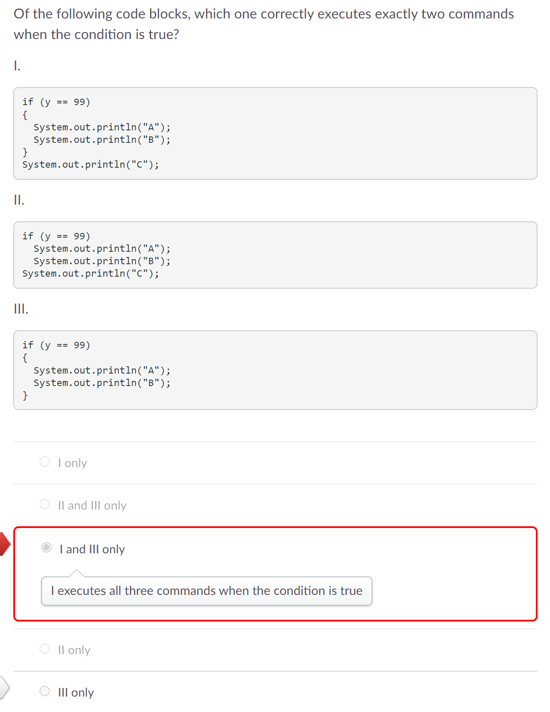
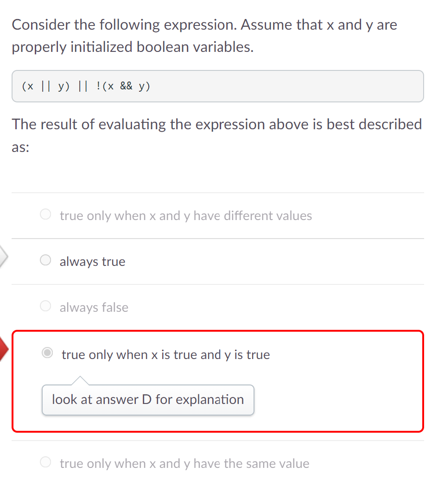
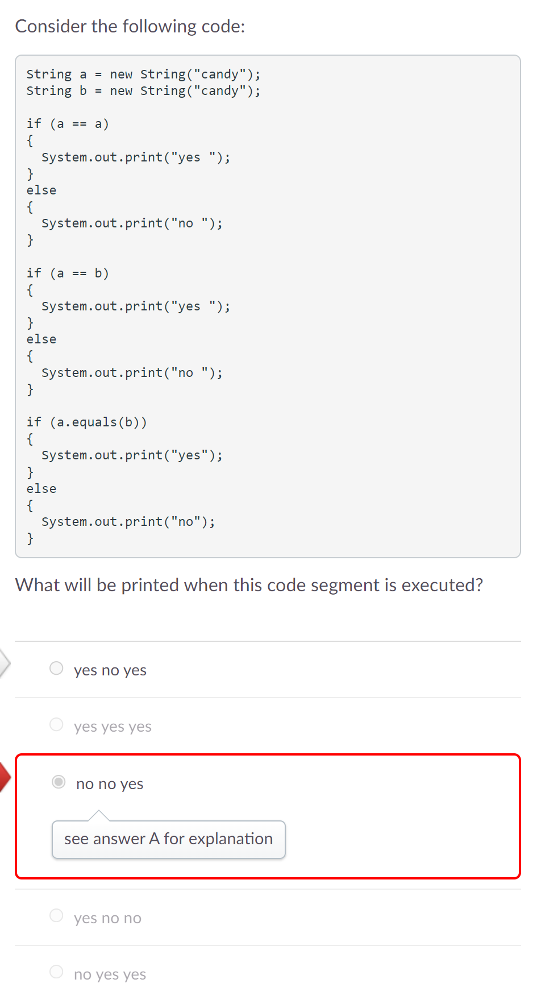

# Process Writeup
## Name: Xin Yan Huang
## Course: APCSA
## Period: 7
## Concept: Conditionals (UNIT 3)

### Context
I have finished Unit 2 of APCSA which was objects. I am now learning about conditionals in Unit 3. We use conditionals (using logical conditions) to help us perform different actions. An example would be if a number is greater than 10, perform this certain task and if a number is greater than 10, perform a different task.
### Overview
#### `if` Statements
`if` statements will execute the code of block if the condition is met. They are usually the most used statement.

Format of `if` Statements:
```java
if(/*condition*/){
    // code here
}
```
#### Relational Operators
Relational Operators are used to check if a primitive or reference value is larger, smaller, or not equal to each other. Here are some relational operators:
* `==` - Equal to
* `<` - Less than
* `<=` - Less than or equal to
* `>` - Greater than
* `>=` - Greater than or equal to
* `!=` - Not equal to

#### `else` Statements
`else` statements are executed when an `if` statement is false.

Format of an `else` Statement:
```java
else {
    // code here
}
```
#### `else if` Statements
`else if` statements are another type of statement. They are placed between the `if` statement and the `else` statement.

Format of an `else if` Statement:
```java
else if (/*condition*/){
    // code here
}
```
#### Logical Operators
Logical operators can also be used to represent multiple conditions in one statement. Here are some logical operators:
* `&&` - AND (Both conditions need to be true to evaluate the condition as true)
* `||` - OR (Either condition needs to be true to evaluate the condition as true)
* `!` - NOT (Evaluate the condition as the opposite)

### Challenges
#### Exam / Quiz Questions
After doing lessons 1 - 4, my class and I would have a quiz to check our understanding. I got two questions wrong for this Unit 3 quiz.

This is the first question:
<p align="center">
    
</p>

I didn't look really closely at the code because there are no curly braces `{}` for the `if` statement. You can leave the curly braces out if there is only one line of code for each statement. Here's an example:
```java
if(num > 10)
    num = 10;
```
If there are two or more lines of code in your statement that aren't enclosed by the curly braces, the second or more lines of code will not be executed by the statement. Since the question asked me to set `num` equal to 10 if the initial value of `num` is less than 10 and print out a warning, I need two lines of code which means they need to be in curly braces. I put my answer as `No correction should be made`. However, this wasn't the correct answer as `num` will always be set to 10 even if the value of `num` is greater than 10 which we don't want. We only want `num` to be set to 10 whenever `num` is less than 10 not greater than 10.

This is the second question:
<p align="center">
    
</p>

This question tricked me and many of my classmates. After I read the question, I thought that which condition would only print out exactly two commands. I looked at each code block. I see that the first code block and third code block print out exactly two commands. However, this wasn't the right choice as the question really meant which code block prints exactly two commands in total. In this case, the third code block would be correct making `III only` the correct answer.

For the Unit 3 exam, I got some questions wrong. I will be going over why I got these questions wrong.

Here's one of the questions:
<p align="center">
    
</p>

I didn't really spend enough time to answer this question. My answer, `true only when x is true and y is true` was my guess for this question. This wasn't the actual answer. The correct answer was `always true`. To help me understand why it was `always true`, I will use actual boolean values instead of `x` and `y`. I will set `x` as `true` and `y` as `false`. I am setting these values as that because my answer which was wrong said that this expression is true only when both `x` and `y` are true. I am using different boolean values to prove that my answer was wrong. Moving on, if we plug `x` and `y` into the expression, it would look like this:
```java
(true || false) || !(true && false)
```
We will look at `(true || false)` first. In this condition, it will return a `true` value because when either value is `true`, the condition is true. Now, we don't have to look at `!(true && false)` because since `(true || false)` is true, then the whole expression is true. The reason is the second `||` operator compares the two conditions `(true || false)` and `!(true && false)`. Since this is an `or` operator, that means either condition can be true to evaluate this expression as true. Since we have a `true` value already, there's no need to compare the second condition.

Here's another question:
<p align="center">
    
</p>

There are 3 pairs of `if` and `else` statements meaning we need to check all three of them. For the first pair, we look at the `if` condition first. We look at `(a == a)` and we see that it is comparing the same string meaning this condition would be true and we don't have to execute code from the `else` statement. The output of the first pair would be:
```java
yes
```
Now, we look at the second pair's `if` statement first. The `if` statement compares `String a` and `String b`. Since this is an `equal to` operator and we are comparing references, we are looking if both strings have the same memory location. `String a` and `String b` don't have the same memory location as they were created differently, but they do have the same value. The output of the second pair would be:
```java
no
```

Here's another question:
<p align="center">
    
</p>

Lastly, we look at the third pair's `if` statement first. Since the condition for the `if` statement is `a.equals(b))`, we are trying to see if the values of `a` and `b` are the same. When we look at the code where `String a` and `String b` were initialized and declared, they both have the value of `candy` making this `if` statement true. The output of the third pair would be:
```java
yes
```
If we combine these outputs together, the result would be:
```java
yes no yes
```
My answer was `no no yes`. When I read the first `if` statement, I read the condition as `a == b` which gave me the answer as `no` for the first condition. I didn't look carefully which ultimately cost me a question.

Going over the questions has definitely helped me understand the mistakes I made during the time when I didn't know exactly what these questions were looking for. It has made me more knowledgeable about the content.

### Takeaways
* Reread the questions a few more times to make sure you understand what the prompt is actually asking you
* Reread the code of block again if you weren't 100% sure
* Going over the mistakes you've made is a good way to learn more information
