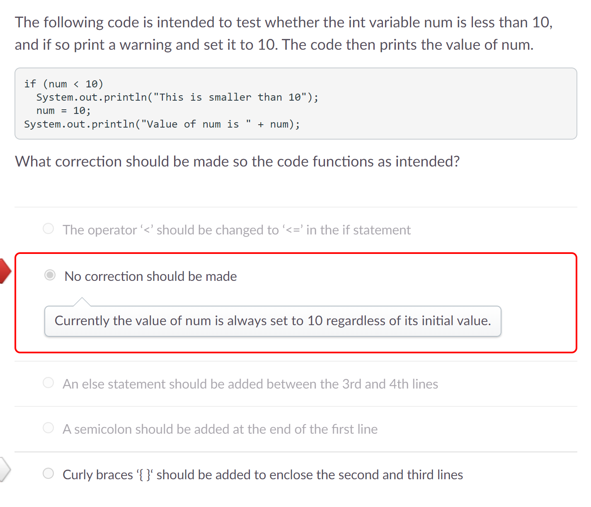

# Process Writeup
## Name: Xin Yan Huang
## Course: APCSA
## Period: 7
## Concept: Objects (UNIT 3)

### Context
I have finished Unit 2 of APCSA which was objects. I am now learning about conditionals in Unit 3. We use conditionals (using logical conditions) to help us perform different actions. An example would be if a number is greater than 10, perform this certain task and if a number is greater than 10, perform a different task.
### Overview
#### `if` Statements
`if` statements will execute the code of block if the condition is met. They are usually the most used statement.

Format of `if` Statements:
```java
if(/*condition*/){
    // code here
}
```
#### Relational Operators
Relational Operators are used to check if a primitive or reference value is larger, smaller, or not equal to each other. Here are some relational operators:
* `==` - Equal to
* `<` - Less than
* `<=` - Less than or equal to
* `>` - Greater than
* `>=` - Greater than or equal to
* `!=` - Not equal to 

#### `else` Statements
`else` statements are executed when an `if` statement is false.

Format of an `else` Statement:
```java
else {
    // code here
}
```
#### `else if` Statements
`else if` statements are another type of statement. They are placed between the `if` statement and the `else` statement.

Format of an `else if` Statement:
```java
else if (/*condition*/){
    // code here
}
```
#### Logical Operators
Logical operators can also be used to represent multiple conditions in one statement. Here are some logical operators:
* `&&` - AND (Both conditions need to be true to evaluate the condition as true)
* `||` - OR (Either condition needs to be true to evaluate the condition as true)
* `!` - NOT (Evaluate the condition as the opposite)

### Challenges
#### Exam / Quiz Questions
After doing lessons 1 - 4, my class and I would have a quiz to check our understanding. I got two questions wrong for this Unit 3 quiz.

This is the first question:
<p align="center">
    
</p>

I didn't look really closely at the code because there are no curly braces `{}` for the `if` statement. You can leave the curly braces out if there is only one line of code for each statement. Here's an example:
```java
if(num > 10)
    num = 10;
```
If there are two or more lines of code in your statement that aren't enclosed by the curly braces, the second or more lines of code will not be executed by the statement. Since the question asked me to set `num` equal to 10 if the initial value of `num` is less than 10 and print out a warning, I need two lines of code which means they need to be in curly braces. I put my answer as `No correction should be made`. However, this wasn't the correct answer as `num` will always be set to 10 even if the value of `num` is greater than 10 which we don't want. We only want `num` to be set to 10 whenever `num` is less than 10 not greater than 10.

This is the second question:
<p align="center">
    
</p>
This question tricked me and many of my classmates. After I read the question, I thought that which condition would only print out exactly two commands. I looked at each code block. I see that the first code block and third code block print out exactly two commands. However, this wasn't the right choice as the question really meant which code block prints exactly two commands in total. In this case, the third code block would be correct making `III only` the correct answer.

For the Unit 3 exam, I got some questions wrong. 

Here's one of the questions:


### Takeaways
* Reread the questions or block of code a few more times to make sure you understand what the prompt is actually asking you
